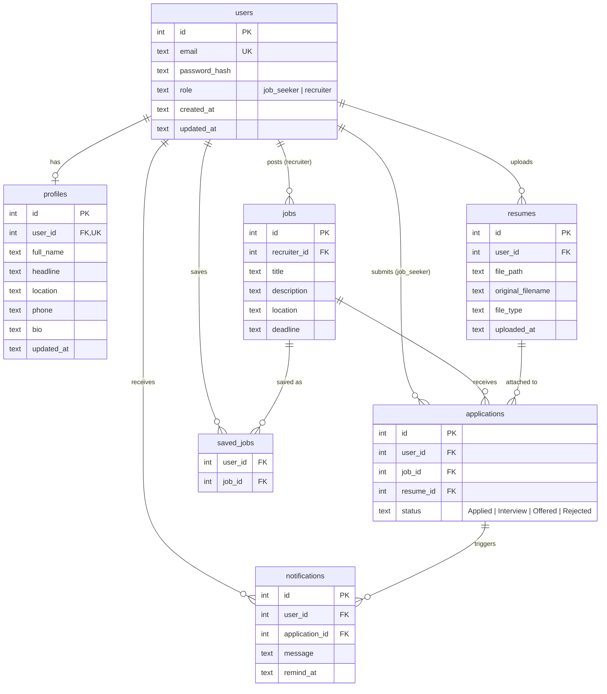

# CareerConnect ERD

Sprint 1 tables: `users`, `profiles`, `resumes`. The rest are designed now and built in later sprints.

```mermaid
erDiagram
  users ||--o| profiles : has
  users ||--o{ resumes : uploads
  users ||--o{ jobs : "posts (recruiter)"
  users ||--o{ applications : "submits (job_seeker)"
  users ||--o{ saved_jobs : saves
  users ||--o{ notifications : receives
  jobs ||--o{ applications : receives
  jobs ||--o{ saved_jobs : "saved as"
  applications ||--o{ notifications : triggers
  resumes ||--o{ applications : "attached to"

  users {
    int id PK
    text email UK
    text password_hash
    text role "job_seeker | recruiter"
    text created_at
    text updated_at
  }
  profiles {
    int id PK
    int user_id FK,UK
    text full_name
    text headline
    text location
    text phone
    text bio
    text updated_at
  }
  resumes {
    int id PK
    int user_id FK
    text file_path
    text original_filename
    text file_type
    text uploaded_at
  }
  jobs {
    int id PK
    int recruiter_id FK
    text title
    text description
    text location
    text deadline
  }
  applications {
    int id PK
    int user_id FK
    int job_id FK
    int resume_id FK
    text status "Applied | Interview | Offered | Rejected"
  }
  saved_jobs {
    int user_id FK
    int job_id FK
  }
  notifications {
    int id PK
    int user_id FK
    int application_id FK
    text message
    text remind_at
  }
```
